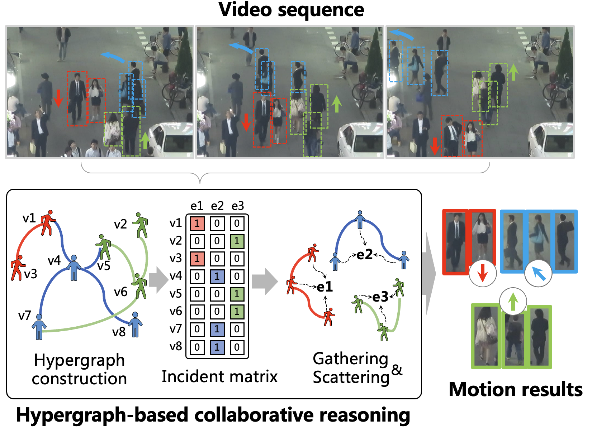

<!-- # HyperMOT -->

# Hypergraph-State Collaborative Reasoning for Multi-Object Tracking

<div align="center">
<br>
<a>Zikai Song</a><sup><span>1,2</span></sup>, 
<a>Junqing Yu</a><sup><span>1</span></sup>,
<a>Yi-Ping Phoebe Chen</a><sup><span>3</span></sup>,
<a>Wei Yang</a><sup><span>1</span></sup>,
<a>Xinchao Wang</a><sup><span>2</span></sup>,
<br>

<sup>1</sup> Huazhong University of Science and Technology <br>
<sup>2</sup> National University of Singapore <br>
<sup>3</sup> La Trobe University<br>    
*[paper](https://arxiv.org/abs/2407.20730)*
<br>
</div>


<p align="center">
    
</p>

Motion reasoning serves as the cornerstone of multi-object tracking (MOT), as it enables consistent association of targets across frames. However, existing motion estimation approaches face two major limitations: (1) instability caused by noisy or probabilistic predictions, and (2) vulnerability under occlusion, where trajectories often fragment once visual cues disappear.
To overcome these issues, we propose a **collaborative reasoning** framework that enhances motion estimation through joint inference among multiple correlated objects. By allowing objects with similar motion states to mutually constrain and refine each other, our framework stabilizes noisy trajectories and infers plausible motion continuity even when target is occluded.
To realize this concept, we design **HyperSSM**, an architecture that integrates Hypergraph computation and a State Space Model (SSM) for unified spatial–temporal reasoning. The Hypergraph module captures spatial motion correlations through dynamic hyperedges, while the SSM enforces temporal smoothness via structured state transitions. This synergistic design enables simultaneous optimization of spatial consensus and temporal coherence, resulting in robust and stable motion estimation.
Extensive experiments on four mainstream and diverse benchmarks(MOT17, MOT20, DanceTrack, and SportsMOT) covering various motion patterns and scene complexities, demonstrate that our approach achieves state-of-the-art performance across a wide range of tracking scenarios. 

## Code

- The Code will be released soon in May 2026!

## Citation

If you find this repo useful for your research, please consider citing the paper

```
@misc{song2026hyperssm,
      title={Hypergraph-State Collaborative Reasoning for Multi-Object Tracking}, 
      author={Zikai Song and Junqing Yu and Yi-Ping Phoebe Chen and Wei Yang and Xinchao Wang},
      year={2026},
      eprint={2604.12665},
      archivePrefix={arXiv},
      primaryClass={cs.CV},
      url={https://arxiv.org/abs/2604.12665}, 
}
```

<!--## Acknowledgement

We would like to thank the following repos for their great work:

- This work is built upon the[CoTracker]([https://github.com/OpenGVLab/MM-Interleaved](https://github.com/facebookresearch/co-tracker))
 -->
